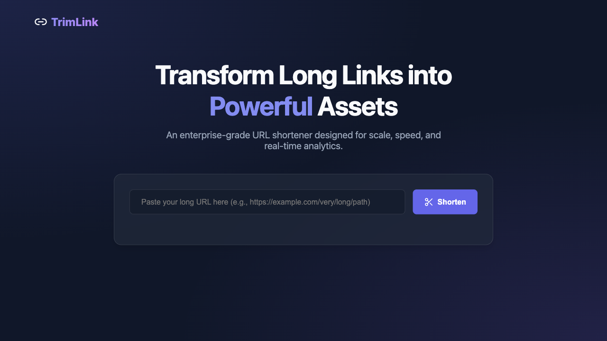
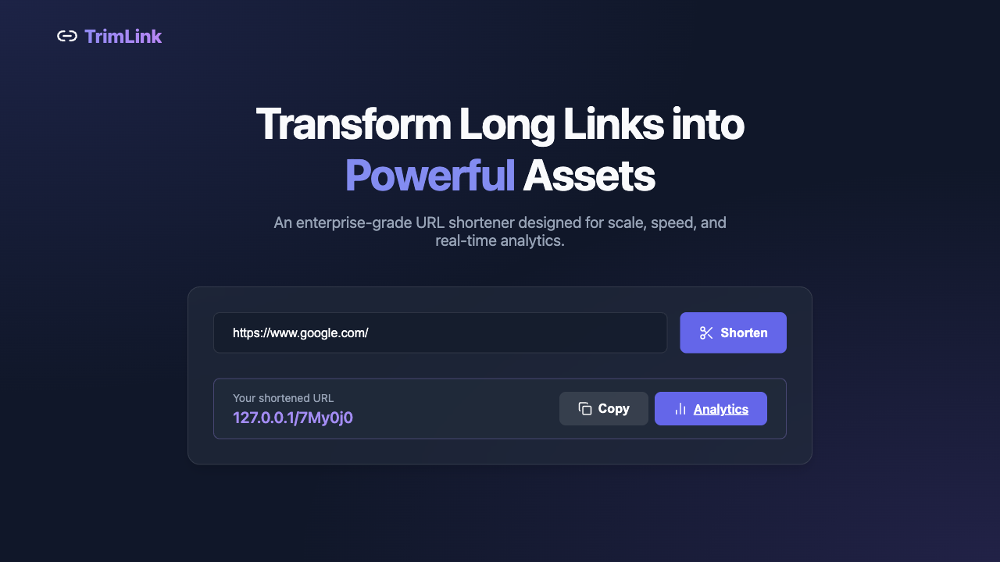
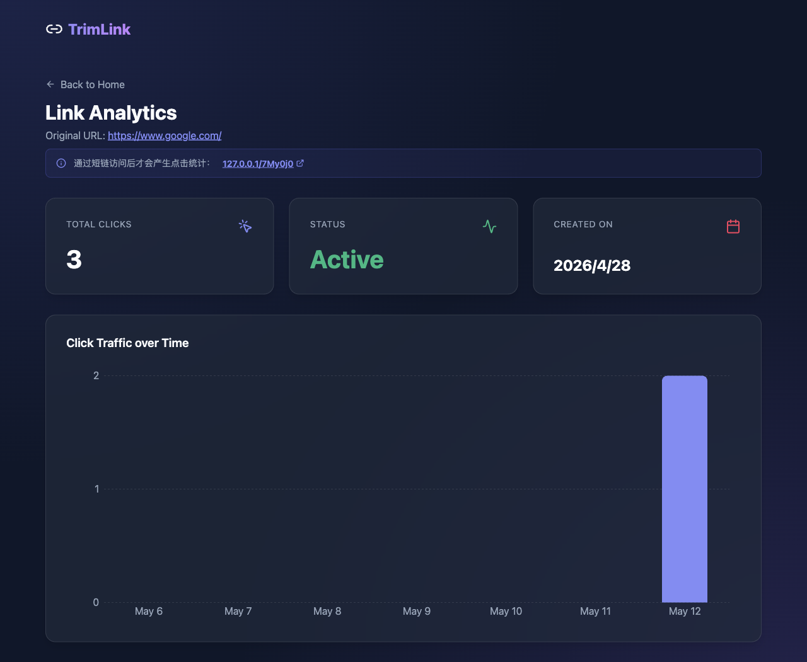

# TrimLink

TrimLink 是一个面向实际部署场景的短链接系统，采用 `React + Vite` 前端、`Go + Gin` 后端，并结合 `MySQL + Redis` 实现短链生成、访问跳转、访问统计与缓存加速。项目已经包含本地开发、Docker 部署、以及京东云服务器上线所需的完整基础设施配置。

## Demo 演示

以下截图均为应用页面本体截图，不包含浏览器窗口外框，便于在 GitHub README 中保持更干净的展示效果。

### 1. 首页与生成
输入长链接即可快速生成唯一的短码，界面简洁美观，支持一键复制。



### 2. 生成结果
生成后可直接查看短链接，并提供进入分析页面的入口。



### 3. 数据分析
实时统计短链接的访问数据，包括总点击量、服务状态以及每日访问趋势图，图表使用整数刻度展示每日点击次数。



## 项目亮点

- 前后端分离：前端专注交互体验，后端专注短链生成、跳转和统计接口。
- 完整短链闭环：支持创建短链、访问跳转、点击记录、访问趋势分析。
- 多层缓存设计：内存缓存 + Redis + MySQL，兼顾访问速度与数据持久化。
- 生产可部署：提供 `Dockerfile`、`docker-compose.prod.yml`、`Nginx` 配置与云服务器部署文档。
- 用户体验细节完善：HTTP 场景下复制按钮可降级工作，零访问量短链也能展示分析页面。
- 配置化运行：数据库、Redis、端口、前端 API 地址均支持环境变量覆盖。

## 功能特性

- 输入长链接后生成 6 位短码
- 同一原始链接可复用已有短链
- 访问短链时执行 `302` 跳转
- 记录访问 IP、User-Agent 与时间
- 查看短链累计点击次数与按天统计趋势
- 支持本地开发、Docker 本地运行、云服务器生产部署

## 技术栈

### 前端

- React
- Vite
- React Router
- Axios
- Recharts
- Lucide React

### 后端

- Go
- Gin
- GORM
- MySQL
- Redis

### 部署

- Docker
- Docker Compose
- Nginx

## 项目结构

```text
url-shortener/
├── backend/                    # Go 后端
│   ├── config/                 # 运行配置
│   ├── controllers/            # 业务控制器
│   ├── database/               # MySQL / Redis 初始化
│   ├── models/                 # 数据模型
│   ├── routes/                 # 路由注册
│   ├── utils/                  # 工具函数
│   ├── Dockerfile              # 后端镜像构建文件
│   └── main.go                 # 服务入口
├── frontend/                   # React 前端
│   ├── src/
│   │   ├── components/         # 首页与分析页组件
│   │   ├── services/           # API 请求层
│   │   └── App.jsx             # 前端路由入口
│   └── Dockerfile              # 前端镜像构建文件
├── deploy/nginx/default.conf   # 生产 Nginx 配置
├── docker-compose.yml          # 本地依赖服务
├── docker-compose.prod.yml     # 生产整套部署
├── .env.production.example     # 生产环境变量示例
└── DEPLOY_JDCLOUD.md           # 京东云部署说明
```

## 核心流程

### 1. 创建短链

1. 前端向 `POST /api/shorten` 提交原始链接
2. 后端校验 URL 格式
3. 若数据库已存在相同原始链接，则直接返回已有短链
4. 否则生成唯一短码并写入 MySQL
5. 同时写入 Redis 与内存缓存，提升后续跳转速度

### 2. 访问短链

1. 用户访问 `/:code`
2. 后端优先查内存缓存，再查 Redis，最后回源 MySQL
3. 找到对应长链接后执行 `302` 跳转
4. 异步记录点击日志并更新总点击数

### 3. 查看分析

1. 前端请求 `GET /api/stats/:code`
2. 后端返回短链基础信息与按天聚合的点击数据
3. 即使当前无人访问，前端也会正常展示分析界面，总次数显示为 `0`

## 快速开始

### 方式一：本地开发

先启动 MySQL 和 Redis：

```bash
docker compose up -d
```

启动后端：

```bash
cd backend
go mod tidy
go run .
```

如需自定义后端连接信息，可设置环境变量：

```bash
export MYSQL_DSN="root:password@tcp(127.0.0.1:3306)/shortener?charset=utf8mb4&parseTime=True&loc=Local"
export REDIS_ADDR="127.0.0.1:6379"
export REDIS_PASSWORD=""
export REDIS_DB="0"
export PORT="8081"
```

启动前端：

```bash
cd frontend
npm install
npm run dev
```

前端默认开发地址通常为：

```text
http://127.0.0.1:5173
```

如果前端需要显式指定后端地址，可创建 `frontend/.env.local`：

```bash
VITE_BACKEND_URL=http://127.0.0.1:8081
```

### 方式二：Docker 本地整套运行

如果你只想启动数据库和 Redis，用根目录的 `docker-compose.yml`：

```bash
docker compose up -d
```

如果你想一次性启动前端、后端、MySQL、Redis 的生产形态，请使用：

```bash
cp .env.production.example .env
docker compose --env-file .env -f docker-compose.prod.yml up -d --build
```

默认完成后，站点可从以下地址访问：

```text
http://127.0.0.1
```

## 环境变量说明

### 后端环境变量

| 变量名 | 说明 | 默认值 |
| --- | --- | --- |
| `MYSQL_DSN` | MySQL 连接串 | 本地开发 DSN |
| `REDIS_ADDR` | Redis 地址 | `127.0.0.1:6379` |
| `REDIS_PASSWORD` | Redis 密码 | 空 |
| `REDIS_DB` | Redis DB 编号 | `0` |
| `PORT` | 后端监听端口 | `8081` |

### 前端环境变量

| 变量名 | 说明 | 示例 |
| --- | --- | --- |
| `VITE_BACKEND_URL` | 前端请求后端的基础地址 | `http://127.0.0.1:8081` |

说明：

- 在本地开发时建议显式配置 `VITE_BACKEND_URL`
- 在生产环境中若前后端同域部署，可将其留空，统一走反向代理

## API 使用教程

### 1. 创建短链

请求：

```bash
curl -X POST http://127.0.0.1:8081/api/shorten \
  -H "Content-Type: application/json" \
  -d '{"url":"https://www.google.com/"}'
```

示例响应：

```json
{
  "short_url": "http://127.0.0.1:8081/Ua6emV",
  "short_code": "Ua6emV"
}
```

### 2. 访问短链

```bash
curl -I http://127.0.0.1:8081/Ua6emV
```

正常情况下会返回 `302 Found`，并带上目标地址。

### 3. 查询访问统计

```bash
curl http://127.0.0.1:8081/api/stats/Ua6emV
```

示例响应：

```json
{
  "url": {
    "short_code": "Ua6emV",
    "original_url": "https://www.google.com/",
    "clicks": 1,
    "created_at": "2026-05-12T12:00:00Z"
  },
  "stats": [
    {
      "date": "2026-05-12",
      "clicks": 1
    }
  ]
}
```

如果该短链还没有任何访问记录，分析页仍会显示完整卡片，只是点击次数为 `0`。

## 前端使用教程

### 1. 生成短链接

打开首页后，在输入框中粘贴长链接，点击 `Shorten` 即可生成短链。

### 2. 复制短链接

点击 `Copy` 按钮即可复制结果链接。项目对 HTTP 场景做了兼容处理：

- 优先使用 `navigator.clipboard`
- 若浏览器安全策略限制复制，则回退到兼容方案

### 3. 查看分析页

点击 `Analytics` 按钮即可进入统计页面，查看：

- 原始链接
- 短链代码
- 总点击次数
- 每日点击趋势

## 生产部署教程

### 1. 准备环境

服务器需安装：

- Docker
- Docker Compose

### 2. 配置生产环境变量

```bash
cp .env.production.example .env
```

然后根据实际情况修改：

- MySQL 用户名与密码
- Redis 密码
- 对外访问域名或前端 API 地址

### 3. 启动生产服务

```bash
docker compose --env-file .env -f docker-compose.prod.yml up -d --build
```

### 4. 检查运行状态

```bash
docker compose -f docker-compose.prod.yml ps
docker compose -f docker-compose.prod.yml logs -f
```

## 京东云部署参考

项目已附带京东云部署说明文档：

- [DEPLOY_JDCLOUD.md](./DEPLOY_JDCLOUD.md)

适用于将整套服务部署到轻量云主机，并通过公网 IP 或域名访问。

## 为什么这个项目适合开源展示

- 覆盖了一个完整可演示的 Web 产品闭环
- 同时包含前端、后端、数据库、缓存与部署体系
- 代码结构清晰，适合作为全栈项目作品集
- 具备真实线上落地能力，不只是本地 Demo
- 对新手友好，便于学习短链系统的常见设计方式

## 可继续扩展的方向

- 用户系统与登录鉴权
- 自定义短链别名
- 过期时间设置
- 地域 / 设备 / 浏览器维度统计
- 管理后台
- 批量生成短链
- HTTPS 与自定义域名支持
- 反爬与风控策略

## 常见问题

### 为什么同一个长链接会返回同一个短链？

当前实现会优先复用数据库中已有的记录，这样可以避免为相同链接重复创建短码。

### 为什么分析页在零访问量时也能正常显示？

前端已经对空统计数据做了兜底处理，会保留分析布局并展示 `0` 次访问，而不是空白页。

### 为什么复制按钮在 HTTP 页面也能工作？

浏览器在非安全上下文中可能限制现代剪贴板 API，因此项目增加了回退逻辑来兼容这类场景。

## License

本项目采用 [MIT License](./LICENSE) 开源。
